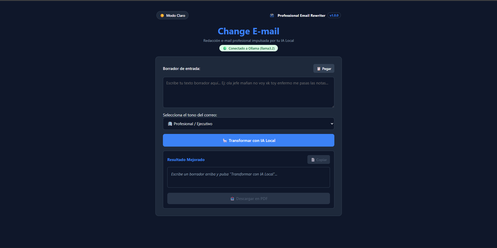
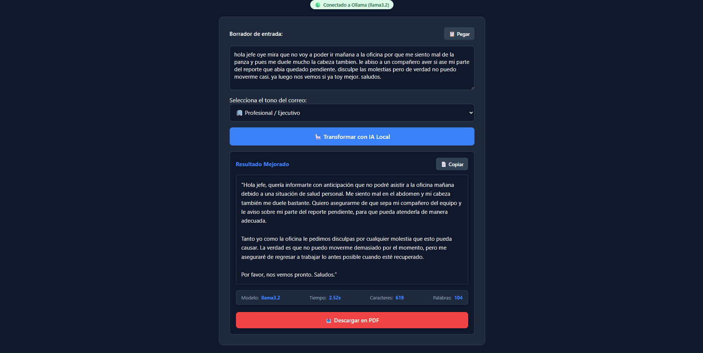

# 📧 Professional Email Rewriter

> Reescribe y mejora correos electrónicos utilizando **Inteligencia Artificial Local** mediante **Ollama** y el modelo **Llama 3.2**, manteniendo la privacidad de los datos al ejecutarse completamente en el ordenador del usuario.


---

# 📖 Descripción

**Professional Email Rewriter** es una aplicación web desarrollada con **HTML, CSS y JavaScript Vanilla** que transforma borradores de correo electrónico en mensajes profesionales utilizando un modelo de lenguaje ejecutado de forma local mediante **Ollama**.

Todo el procesamiento se realiza en el equipo del usuario, sin depender de servicios externos ni enviar información a la nube.

---

# ✨ Características

* ✍️ Corrección ortográfica y gramatical.
* 🤖 Reescritura mediante IA Local.
* 🔒 Privacidad total (procesamiento local).
* 🎯 Selección de diferentes tonos de escritura:

  * Profesional
  * Casual
  * Comercial
  * Legal
  * Académico
  * Soporte técnico
* 📋 Pegar texto desde el portapapeles.
* 📄 Copiar el resultado.
* 📥 Exportar a PDF.
* 🌙 Modo oscuro persistente mediante LocalStorage.
* 🔔 Sistema de notificaciones Toast.
* ⏳ Spinner durante el procesamiento.
* 📊 Estadísticas del texto.
* ❤️ Comprobación automática del estado de Ollama.
* 📱 Diseño Responsive.

---

# 💻 Software y herramientas utilizadas

Durante el desarrollo de este proyecto se han utilizado las siguientes herramientas:

| Herramienta            | Uso                                                                  |
| ---------------------- | -------------------------------------------------------------------- |
| **Visual Studio Code** | Desarrollo del proyecto y edición del código fuente.                 |
| **Ollama**             | Ejecución local del modelo de Inteligencia Artificial.               |
| **Llama 3.2**          | Modelo de lenguaje encargado de reescribir los correos electrónicos. |
| **Google Chrome**      | Pruebas, depuración e inspección mediante DevTools.                  |
| **Git**                | Control de versiones del proyecto.                                   |
| **GitHub**             | Alojamiento del repositorio y publicación del código.                |
| **html2pdf.js**        | Generación de documentos PDF desde el navegador.                     |

---

# 📦 Dependencias

Este proyecto utiliza las siguientes dependencias externas:

| Dependencia     | Función                                                              |
| --------------- | -------------------------------------------------------------------- |
| **html2pdf.js** | Permite exportar el resultado generado por la IA a un documento PDF. |

---

# 🖥️ Entorno de desarrollo

* Sistema operativo: **Windows**
* Editor de código: **Visual Studio Code**
* Control de versiones: **Git**
* Repositorio remoto: **GitHub**
* IA Local: **Ollama**
* Modelo utilizado: **Llama 3.2**
* Navegador de pruebas: **Google Chrome**

---

# 📸 Capturas

## Pantalla principal



```
assets/img/home.png
```

## Resultado generado



```
assets/img/result.png
```

---

# 🎥 Demostración

> Puedes añadir un GIF mostrando el funcionamiento completo de la aplicación.

```
assets/img/demo.gif
```

---

# 🏗️ Arquitectura del proyecto

```
Professional-Email-Rewriter/
│
├── index.html
│
├── assets/
│   ├── css/
│   │   └── style.css
│   │
│   ├── img/
│   │
│   └── js/
│       │
│       ├── app.js
│       ├── config.js
│       │
│       ├── services/
│       │   ├── ollama.service.js
│       │   └── pdf.service.js
│       │
│       └── ui/
│           ├── dom.elements.js
│           ├── stats.ui.js
│           ├── theme.ui.js
│           └── toast.ui.js
│
└── README.md
```

---

# 🧩 Arquitectura de la aplicación

```
Usuario
    │
    ▼
Interfaz (HTML)
    │
    ▼
app.js
    │
    ├───────────────┐
    ▼               ▼
Servicios         Componentes UI
    │               │
    ▼               ▼
Ollama API     Toast, Tema,
Local          Estadísticas
    │
    ▼
Respuesta IA
    │
    ▼
Actualización de la interfaz
```

La aplicación sigue una separación de responsabilidades para facilitar su mantenimiento:

* **app.js** → Orquesta el flujo principal.
* **config.js** → Configuración global.
* **services/** → Comunicación con servicios externos.
* **ui/** → Gestión exclusiva de la interfaz.

---

# 🛠️ Tecnologías utilizadas

## Frontend

* HTML5
* CSS3
* JavaScript ES6+

## APIs del navegador

* Fetch API
* Clipboard API
* LocalStorage API

## Inteligencia Artificial

* Ollama
* Llama 3.2

## Librerías

* html2pdf.js

---

# ⚙️ Instalación

## 1. Clonar el repositorio

```bash
git clone https://github.com/AlejandraB-Romero/Professional-Email-Rewriter.git
```

## 2. Instalar Ollama

https://ollama.com/

## 3. Descargar el modelo

```bash
ollama pull llama3.2
```

## 4. Iniciar Ollama

```bash
ollama serve
```

La API quedará disponible en:

```
http://localhost:11434
```

## 5. Ejecutar la aplicación

Abrir `index.html` directamente o utilizar **Live Server** desde Visual Studio Code.

---

# 🚀 Funcionamiento

1. Escribir o pegar un borrador.
2. Seleccionar el tono del correo.
3. Pulsar **Transformar con IA Local**.
4. La aplicación envía el texto a Ollama mediante una petición HTTP.
5. El modelo genera una nueva versión del correo.
6. El usuario puede:

   * Copiar el resultado.
   * Descargarlo como PDF.

---

# 📚 Conceptos practicados

Durante el desarrollo de este proyecto se han aplicado conceptos como:

* Manipulación del DOM.
* Organización modular del código.
* Programación asíncrona (`async/await`).
* Consumo de APIs REST mediante `fetch`.
* Gestión de estados de la interfaz.
* Manejo de errores.
* Persistencia con LocalStorage.
* Arquitectura basada en separación de responsabilidades.
* Componentes reutilizables.
* Diseño Responsive.
* Experiencia de Usuario (UX).

---

# 🔮 Mejoras futuras

* Selección dinámica del modelo de IA.
* Traducción automática.
* Historial de correos.
* Plantillas personalizadas.
* Soporte para múltiples idiomas.
* Exportación a Word (.docx).
* Configuración editable de prompts.
* Autoguardado del borrador.
* Contador de tiempo de generación.
* Docker para facilitar el despliegue.

---

# 💡 Motivación

Este proyecto nace como parte de mi proceso de aprendizaje en **Desarrollo de Aplicaciones Web (DAW)** con el objetivo de profundizar en JavaScript moderno, el consumo de APIs y la integración de modelos de Inteligencia Artificial ejecutados de forma local mediante Ollama.

Además del funcionamiento de la aplicación, el proyecto pone especial atención en la organización del código, la mantenibilidad y la experiencia de usuario.

---

# 🎯 Competencias demostradas

Con este proyecto he puesto en práctica:

* Desarrollo de aplicaciones web con HTML5, CSS3 y JavaScript (ES6+).
* Consumo de APIs REST mediante `fetch`.
* Programación asíncrona con `async/await`.
* Organización modular del código.
* Separación de responsabilidades (UI, Servicios, Configuración y Aplicación).
* Manipulación del DOM.
* Persistencia de datos mediante LocalStorage.
* Gestión de estados de la interfaz de usuario.
* Integración de Inteligencia Artificial Local mediante Ollama.
* Diseño responsive y experiencia de usuario (UX).
* Uso de Git y GitHub para el control de versiones.

---

# 👩‍💻 Autor

**Alejandra Begoña Romero Pérez**

🎓 Estudiante de Desarrollo de Aplicaciones Web (DAW)

💼 Interesada en Desarrollo Web Full Stack e Inteligencia Artificial aplicada al desarrollo de software.

GitHub:
**https://github.com/AlejandraB-Romero**

---

# 📄 Licencia

Este proyecto se distribuye bajo la licencia **MIT**.
